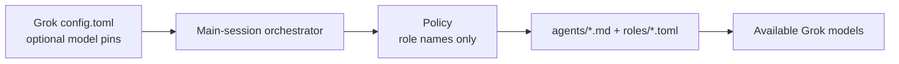

# pilotfish-grok Design Rationale

> Grok Build port of [pilotfish](https://github.com/Nanako0129/pilotfish)
> orchestration. Same architecture and phase-aware lifecycle; install surface
> and capability primitives are native Grok. The seven-role host-port shape
> also appears in [pilotfish-codex](https://github.com/miyago9267/pilotfish-codex).
> This project has its own release train.

## Purpose

Preserve pilotfish's separation of concerns and phase-aware orchestration in
native Grok Build configuration. Role-based policy, approval gates, leaf
workers, and fresh-context verification stay; Claude-specific mechanisms
(`settings.json`, `tools:` allowlists, `Explore` shadowing, Sonnet buckets)
are replaced with Grok surfaces.

## Three-layer translation

| Layer | Grok surface | Owns |
|---|---|---|
| Machine | `~/.grok/config.toml` | Subagent enablement; Claude compatibility isolation; optional `[subagents.models]` pins; never forces main-session model by default |
| Roles | `~/.grok/agents/*.md` + `~/.grok/roles/*.toml` | Role contract, capability mode, reasoning effort, optional model |
| Policy | `~/.grok/rules/pilotfish-grok.md` | Phase gates, delegation boundaries, approval, integration, verification |

> **Core invariant:** The orchestration **policy names roles but never embeds**
> model IDs or effort levels. Routing changes in agent/role files or
> `[subagents.models]` must not require rewriting the policy.

## Seven Grok roles

| Role | Phase | Capability | Effort | Responsibility |
|---|---|---|---|---|
| `scout` | Discovery | `read-only` | low | Broad or focused recon |
| `plan-verifier` | Plan | `read-only` | medium | `READY` / `REVISE` |
| `security-reviewer` | Plan / Approval | `read-only` | high | Pre-approval security evidence |
| `mech-executor` | Execution | `all` | low | Complete mechanical specs |
| `executor` | Execution | `all` | medium | Local design judgment |
| `verifier` | Verification | `execute` | medium | `CONFIRMED` / `REFUTED` / `INCONCLUSIVE` |
| `security-executor` | Execution | `all` | high | Approved security implementation |

Pilotfish's uppercase `Explore` role is deliberately absent. That name exists
to shadow Claude Code's built-in Explore agent so expensive main-session models
do not silently run exploration. Grok already has a separate built-in `explore`
type; `scout` covers pilotfish-grok discovery. Installing a second discovery
agent would duplicate boundaries without the Claude-specific benefit.

Grok 0.2.106 still discovers `~/.claude/agents/Explore.md` as an uppercase
custom subagent even when `[compat.claude] agents = false`. The machine layer
therefore sets the exact case-sensitive `[subagents.toggle] "Explore" = false`;
lowercase built-in `explore` remains available. Any additional Claude agent
found by installer preflight receives its own false toggle.

The other Claude imports also have two control planes. All six
`[compat.claude]` cells are false, while every plugin rooted under
`~/.claude/` is separately added to `[plugins] disabled`. This keeps
Claude Code itself unchanged while preventing its skills, instructions, hooks,
MCPs, agents, and plugins from affecting Grok policy experiments.

### Why verifier uses `execute`, not `read-only`

Claude Pilotfish lets the verifier run Bash while denying Write tools. Grok's
`read-only` capability mode also denies shell. Outcome verification needs tests
and flow reproduction, so the Grok mapping is `execute` (read + shell, no file
edits).

The verifier receives an exact claim and acceptance and reports calibrated
evidence, not finding volume. `REFUTED` needs a reproducible P0-P2 blocker and
takes precedence over missing evidence for another condition. Without such a
blocker, any unevaluated required condition produces `INCONCLUSIVE` with a
retry condition. P3/P4 remain advisory. The main session independently
adjudicates reproducibility, scope, claim relevance, priority, and confidence.
Regressions caused by the reviewed implementation remain claim-relevant even
when the brief omitted the affected flow. P0 freezes the slice, and introduced
P2 regressions must be fixed or paused rather than hidden by a narrowed claim.

### Capability enforcement order

1. Harness depth limit (subagents cannot spawn subagents)
2. Role `default_capability_mode` on named types
3. Agent prompt contracts (leaf language, no-edit language)
4. Orchestrator discipline: do not override `capability_mode` on named roles

Parent **Plan Mode does not protect child writes**. The mandatory
`plan-verifier` therefore keeps its own `read-only` role capability instead of
relying on the parent remaining in Plan Mode.

## Effort-first economics

On accounts with a single coding model (for example only `grok-4.5`), multi-model
subscription savings do not apply. pilotfish-grok still pays for itself by:

- Keeping high-volume recon off the main context window
- Bounding mechanical work to low reasoning effort
- Requiring fresh-context verification for non-trivial claims

When cheaper models appear in the catalog, pin them under `[subagents.models]`
without editing policy prose.

## Phase-aware orchestration

Role matching makes work eligible for delegation; it does not make delegation
mandatory. The main session retains framing, Plan synthesis, architecture,
ambiguity resolution, integration, and final judgment.

Plan readiness is the deliberate exception to optional role dispatch. For
large, ambiguous, architectural, risky, or explicitly plan-first work, the
orchestrator calls `enter_plan_mode` before repository discovery, writes the
session `plan.md`, and sends the full Plan to a fresh read-only
`plan-verifier`. `REVISE` returns ownership to the main session; only `READY`
allows `exit_plan_mode` to open the native approval surface. The same readiness
gate applies when the user entered Plan Mode with `/plan`. Automatic permission
grants are tool authorization, not approval of the implementation Plan.

Large Plans use one program envelope plus independently approvable execution
slices. Review the envelope, then only the next executable slice. `READY` is
bare; structured `REVISE` identifies each blocker and its closure check. Two
automatic revisions for one unit are the limit before user direction. This
pauses that unit without treating it as ready or blocking unrelated ready
slices; shared constraints and prerequisites still gate dependent work.

For non-security-sensitive work, a single unknown bug should not become a
sequential `scout` → `executor` pipeline when diagnosis, patch design, and live
verification share one evidence chain.

Long autonomous work uses orchestration labels `AUTO` or `ASK`; neither toggles
Grok's `/auto` or permission mode. `AUTO` grants only approved reversible work
and bounded P2 adjudication, never new VCS, publish, install, credential,
destructive, external, scope, or spend authority. `ASK` uses a native question
tool only when the current session exposes one; otherwise the turn ends
`PAUSED_NEEDS_USER`, and headless execution exits without polling or guessing.
P0 freezes the affected dependency chain. Every verification run shares five
materially changed P1/P2 fix/reverify passes (1-2 normal, 3-5 recovery) before
`PAUSED_VERIFICATION`. Verification identity includes the complete tested
candidate, claim, acceptance, contract, external evidence or prerequisites, and
environment; a prior verifier's own output is not a change. The candidate
fingerprint covers committed head, tracked and staged diff, untracked input
paths plus content, and dirty submodule content. Artifact digests complement
source identity unless the artifact is the sole deliverable. P2 waits for the
next coherent boundary, P3/P4 get no dedicated loop, and `INCONCLUSIVE` gets one
retry after a material change.

## Deliberately left out

| Not included | Why |
|---|---|
| Eighth `Explore` agent | No Claude-style shadow need; `scout` is enough |
| Forced main-session model | User-controlled; Grok has no `best` alias story |
| Claude-style baton gate | [e2e-dispatch](../benchmarks/e2e-dispatch/README.md) covers adversarial approval bypass plus forced spawn plumbing, not a complete multi-turn Baton workflow |
| General unprompted role-routing eval | `ambient-native-plan` covers the mandatory Plan lifecycle; free-form role choice outside that gate remains out of scope |
| Enforcement hooks | Policy-first, matching Pilotfish philosophy |
| Per-project install | Global `~/.grok/` is the product surface |
| Editing `~/.claude/` | Isolation is Grok-owned config only; Claude pilotfish remains independent |

## Relationship to siblings

| Project | Host | Policy markers | Roles |
|---|---|---|---|
| pilotfish | Claude Code | `pilotfish` | 8 (incl. Explore) |
| pilotfish-grok | Grok Build | `pilotfish-grok` | 7 |
| pilotfish-codex | Codex CLI | `pilotfish-codex` | 7 |

Useful pilotfish changes may be adapted when they fit Grok. Source parity is
not an independent goal; Grok-specific needs take priority.
